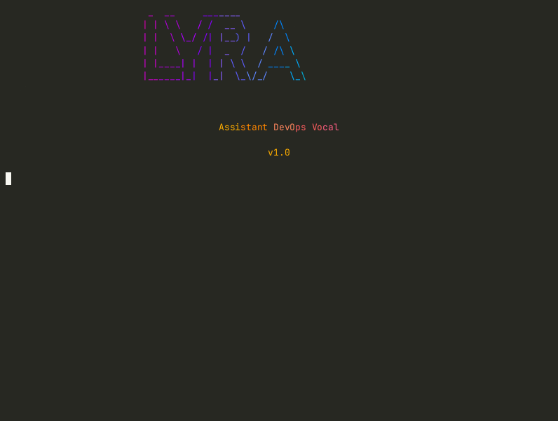
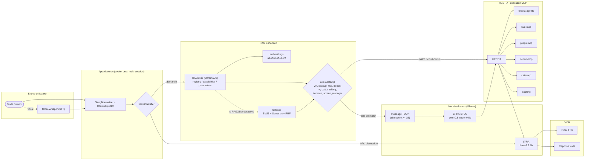

# Lyra

[](https://github.com/amineutron/lyra/actions/workflows/tests.yml) [](LICENSE) [](https://www.python.org/downloads/)

**English summary.** Lyra is a voice-driven DevOps assistant that runs locally by default: Ollama models, faster-whisper speech-to-text, Piper text-to-speech, a three-tier RAG over MCP tool specs, and a resident daemon with text, voice and web clients. It drives KVM virtual machines, backups and home devices through MCP servers, and never runs a sensitive action without a human confirmation. AGPL-3.0 with a commercial option; French-first interface. What is captured and what leaves the machine: [docs/DATA_FLOWS.md](docs/DATA_FLOWS.md).

Assistant vocal DevOps **local par défaut** — pas d'API cloud, pas de facture, sorties réseau optionnelles et [listées](docs/DATA_FLOWS.md). Tu lui parles (ou tu lui écris) en français, il gère tes VMs, tes backups, ta TV, tes lumières. Tout tourne sur ta machine : LLM via Ollama, reconnaissance vocale, synthèse vocale.

Née comme copilote pour gérer un homelab (KVM, backups, domotique), Lyra s'appuie sur un pipeline RAG à 3 niveaux + un routage à base de règles pour éviter d'interroger un LLM à chaque requête triviale — résultat : des réponses en dessous de la seconde une fois le démon chaud.

## Démo, en vrai


Enregistrée sur le démon réel avec [`docs/demo/record.sh`](docs/demo/record.sh) : une requête de lecture, puis « supprime la vm test-vm » que Lyra propose comme action destructive et annule quand on répond non.



L'animation jouée à la fin de `install.sh` (`intro/lyra_intro.sh`) : elle sonde la vraie installation (runtime, GPU, modèles Ollama, serveurs MCP, sudoers, alias, service de suivi). Régénérée avec [`docs/demo/record_intro.sh`](docs/demo/record_intro.sh).

## Un aperçu

Lyra a une petite sœur web : neutroncore, un hub PWA qui permet de discuter avec elle depuis le navigateur (mobile compris), avec le même thème visuel — palette or/rose "réacteur" reprise directement dans l'installeur en ligne de commande.

!neutroncore

## Fonctionnalités

- **VMs KVM** : démarrer, arrêter, cloner, snapshots, exécution de commandes, vérification de clones
- **Backups** : status, liste, création, restauration, vérification, nettoyage (Timeshift/Borg/snapshot)
- **Domotique** : TV Philips (power, volume, Ambilight, apps, YouTube Premium sans pubs via ADB), lumières Hue (couleurs, scènes, groupes), Chromecast (catt), home cinéma Denon
- **Mode vocal** : STT (faster-whisper) + TTS (Piper), 6 voix françaises au choix
- **Mode performance** : domotique sans confirmation (latence < 200ms) — jamais pour VM/backup
- **Human-in-the-loop** : confirmation obligatoire avant toute action sensible, todo-list pour les actions multiples
- **Opérations async** : clone VM, backups longs exécutés en arrière-plan avec notification
- **Démon résident** : sessions multiples, pipeline RAG déjà chaud, ~0.3-1s par requête une fois lancé

## Démo

```
Toi: clone preprod-09 vers sandbox-01 et sandbox-02

[i] Todo list: 2 actions proposees
==================================================
  [1] vm_clone -> sandbox-01
  [2] vm_clone -> sandbox-02
==================================================

Executer ? [T]out / [1] par 1 / [n]on : t

[i] [1/2] vm_clone -> sandbox-01
[+] Operation lancee en arriere-plan.
[i] [2/2] vm_clone -> sandbox-02
[+] Operation lancee en arriere-plan.

[+] Todo list terminee: 2/2 actions
```

## Prérequis

| Composant | Minimum | Confortable |
|---|---|---|
| Système | Fedora 42, Ubuntu 24.04 ou Arch (testés en VM, [protocole](docs/VM_INSTALL_TESTS.md)) | idem |
| Python | 3.11 | 3.12 |
| RAM | 8 Go | 16 Go |
| GPU | aucun : les modèles par défaut (`qwen2.5-coder:0.5b`, `llama3.2:1b`) tournent sur CPU ou sur un Ollama distant (`--ollama-host`) | NVIDIA avec 4 Go de VRAM (`pip install ".[gpu]"` pour faster-whisper sur CUDA) |
| Disque | 3 Go (modèles, voix, dépendances) | 10 Go avec les modèles « production » 7b et 3b |
| Audio | micro et sortie son pour le mode vocal ; rien pour le mode texte | |

Les valeurs par défaut sont volontairement petites ; les modèles plus gros sont commentés dans `config.yaml.example`.

## Démarrage rapide

```bash
git clone https://github.com/amineutron/lyra.git && cd lyra
./installer/install.sh
```

L'installeur (TUI Rich interactif, ou `--app` pour une version graphique locale) détecte ta distro (Fedora/Debian/Arch), installe les dépendances système, crée le venv, télécharge Piper + une voix française, installe le client Ollama et pull deux modèles légers par défaut — **`qwen2.5-coder:0.5b`** (Apache-2.0) et **`llama3.2:1b`** (« Built with Llama », [licence](docs/licenses/LLAMA-3.2-COMMUNITY-LICENSE.txt)), environ **4 Go de VRAM** au total. Les voix Piper et leurs licences sont listées dans [VOICES.md](VOICES.md). Ça tourne sans GPU dédié : `--ollama-host <ip>` pointe vers une machine distante qui héberge Ollama (validé le 2026-08-24 en conditions réelles sur 3 VMs Fedora, Ubuntu et Arch sans GPU : voir [docs/VM_INSTALL_TESTS.md](docs/VM_INSTALL_TESTS.md)).

Aucune commande à copier-coller à la main pour les permissions sudo — l'installeur génère lui-même les règles `sudoers` pour ton utilisateur, pas un nom codé en dur.

### Utilisation

```bash
lyra                          # mode texte interactif
lyra --vocal                  # mode vocal (STT/TTS)
lyra -p                       # mode performance (domotique sans confirmation)
lyra "demarre preprod-09"     # one-shot, sans interface
lyra -y "liste mes VMs"       # one-shot, confirmation auto
```

## Architecture

Chaque requête traverse le démon `lyra-daemon` (socket Unix, pipeline RAG déjà chargé en mémoire, plusieurs sessions en parallèle). Le RAG à 3 niveaux (registry / capabilities / parameters dans ChromaDB) retrouve les outils MCP pertinents ; un système de règles déterministes (`lyra/rules/`) court-circuite EPHAISTOS pour les cas fréquents et fiables ; sinon EPHAISTOS extrait les arguments (avec un encodage TOON qui compresse les specs d'environ 40 % — sauté si le modèle fait moins d'1B, il ne le comprend pas encore) ; LYRA porte la conversation et le ton ; HESTIA exécute et route vers le bon serveur MCP.



## Les mascottes et les divinités — la direction artistique

Lyra emprunte sa palette (or `#f6c177`, rose `#eb6f92`, "thème réacteur") à neutroncore — les deux partagent la même identité visuelle. Ce n'est pas juste un logo : la ligne de commande hérite du même soin.

**Les modèles portent des noms de divinités grecques, pas par hasard :**
- **HESTIA** — déesse du foyer, gardienne de la maison. Dans le code : *"Elle exécute les tâches domestiques (MCP) avec soin."* C'est elle qui parle aux serveurs MCP et garde la maison (le homelab) en ordre.
- **EPHAISTOS** — dieu forgeron, artisan des dieux. Il forge les arguments à partir des specs MCP brutes — le même patronyme que le projet "forge d'agents" prévu pour la suite de Lyra.
- **LYRA** — l'instrument d'Apollon, la voix et l'harmonie. C'est elle qui porte le dialogue, le ton, la personnalité.

**Les mascottes de l'installeur** : 30 créatures ASCII animées (`installer/assets/mascots.json`), réparties en deux familles selon la vitesse d'une étape — *fast* (bolt, comet, atom, pinwheel, radar, rocket, firefly, spark, dart…) pour les étapes rapides, *slow* (owl, cat, turtle, golem, whale, wizard, moon…) pour celles qui prennent leur temps. Chacune a un rôle écrit à la main :

> *owl — "Le hibou : observe longtemps avant de répondre."*
> *comet — "Toujours en mouvement, la traînée raconte d'où elle vient."*
> *golem — "Le golem : la pierre qui pense. Seuls ses yeux bougent."*

Une mascotte est piquée au hasard dans la famille correspondante à chaque étape de l'installeur — une manière de rendre un process forcément un peu long (téléchargements, pip, modèles) plus vivant à regarder.

## Métriques

| Mesure | Valeur |
|---|---|
| Tests unitaires et installeur | **1 004** verts ([CI](https://github.com/amineutron/lyra/actions/workflows/tests.yml), `uv run pytest tests/unit tests/installer`) |
| Pipeline one-shot (démon chaud) | 17.1s → **1.3s** ([`scripts/bench_daemon.py`](scripts/bench_daemon.py), mesure du 2026-08 sur RTX 3080 Ti) |
| REPL prêt | 20s → **0.25s** ([`scripts/bench_daemon.py`](scripts/bench_daemon.py)) |
| Requête chaude (démon déjà lancé) | **0.3–1s** |
| VRAM (mode expérimental, actuel) | **~4 Go** (0.5b + 1b + embeddings) |
| VRAM (mode production, backup) | ~10.5 Go (7b + 3b + embeddings) |
| Outils MCP disponibles | **85**, répartis sur 6 intégrations ([MCP_TOOLS.md](MCP_TOOLS.md)) |
| TTS (Piper, toutes voix) | **< 0.6s** par phrase ([`scripts/bench_tts.py`](scripts/bench_tts.py)) |
| Installeur validé en réel | Fedora, Ubuntu, Arch — sans GPU ([protocole et résultats](docs/VM_INSTALL_TESTS.md)) |

## Intégrations MCP

Catalogue déclaratif (`installer/core/catalog.yaml`), sélectionnable à l'installation :

| MCP | Rôle | Dépôt |
|---|---|---|
| `fedora-agents` | VMs KVM + backups (17 outils) | public |
| `hue-mcp` | Lumières Philips Hue | public |
| `pylips-mcp` | TV Philips (JointSpace + ADB) | public |
| `denon-mcp` | Home cinéma Denon AVR (telnet) | public |
| `catt-mcp` | Cast Chromecast/YouTube | public |
| `tracking` | Suivi des opérations longues | intégré |

Ces dépôts MCP sont publics mais taillés pour ma domotique — le cœur de Lyra (dialogue, RAG, démon, mode texte) fonctionne très bien avec **zéro MCP sélectionné** (testé le 2026-08-24, même protocole). Envie d'écrire ton propre serveur MCP pour ta propre domotique ? Une entrée YAML dans `catalog.yaml` suffit (voir `installer/README.md`).

## Sécurité : ce que le code garantit

| Garantie | Où dans le code | Test |
|---|---|---|
| Confirmation humaine avant toute action ; les outils dangereux ne sont jamais auto-confirmés, même en mode performance | [`lyra/core/constants.py`](lyra/core/constants.py) (`DANGEROUS_TOOLS`, `DESTRUCTIVE_TOOLS`), [`lyra/daemon/actions.py`](lyra/daemon/actions.py) (`_should_skip_confirmation`) | [`tests/unit/test_confirm_prompt.py`](tests/unit/test_confirm_prompt.py) |
| Arguments validés par liste blanche avant tout script shell (noms de VM, chemins, commentaires) | [`scripts/async_mcp_wrapper.py`](scripts/async_mcp_wrapper.py), [`lyra/core/validation.py`](lyra/core/validation.py) | [`tests/unit/test_async_wrapper_validation.py`](tests/unit/test_async_wrapper_validation.py) |
| Lecture de l'état réel avant d'agir (read-first) | [`lyra/core/validation.py`](lyra/core/validation.py) (`validate_vm_existence`) | [`tests/unit/rules/`](tests/unit/rules/) |
| Scripts privilégiés copiés en root et autorisés un par un dans `sudoers.d`, jamais de sudo global | [`installer/core/steps/mcps.py`](installer/core/steps/mcps.py) | [`tests/installer/test_mcps_sudoers.py`](tests/installer/test_mcps_sudoers.py) |
| Secrets hors de `config.yaml` (fichier `secrets.yaml` en 0600, jeton GitHub jamais écrit sur disque) | [`secrets.yaml.example`](secrets.yaml.example), [`installer/core/gitauth.py`](installer/core/gitauth.py) | [`tests/installer/test_gitauth.py`](tests/installer/test_gitauth.py) |
| Aucun chemin personnel ni adresse privée dans le dépôt | garde-fou CI ([workflow](.github/workflows/tests.yml)) | [`tests/unit/test_paths.py`](tests/unit/test_paths.py) |
| Local par défaut : aucune sortie réseau sans configuration explicite | [`docs/DATA_FLOWS.md`](docs/DATA_FLOWS.md) | vérification par `grep` décrite dans le document |

Signaler une faille : [politique de sécurité](https://github.com/amineutron/.github/blob/main/SECURITY.md).

## Configuration

Extrait de `config.yaml` (généré par l'installeur, jamais commité) :

```yaml
models:
  ephaistos:
    name: "qwen2.5-coder:0.5b"   # analyse/arguments — leger, actif par defaut
  lyra:
    name: "llama3.2:1b"          # dialogue/personnalite — leger, actif par defaut

audio:
  sample_rate: 48000
  silence_duration: 1.0

stt:
  model: base
  language: fr

tts:
  model: fr_FR-upmc-medium
```

## Contribuer

La feuille de route est dans [ROADMAP.md](ROADMAP.md) et les [issues](https://github.com/amineutron/lyra/issues) ; les règles dans [CONTRIBUTING](https://github.com/amineutron/.github/blob/main/CONTRIBUTING.md) et le [CLA](CLA.md).

## Part of the Lyra ecosystem

| Dépôt | Rôle |
|---|---|
| [fedora-agents](https://github.com/amineutron/fedora-agents) | MCP : machines virtuelles KVM et sauvegardes |
| [mcp-tracking](https://github.com/amineutron/mcp-tracking) | MCP + API + tableau de bord des tâches longues |
| [neutroncore](https://github.com/amineutron/neutroncore) | hub PWA du homelab |
| [hue-mcp](https://github.com/amineutron/hue-mcp) | MCP Philips Hue (fork de ThomasRohde/hue-mcp) |
| [pylips-mcp](https://github.com/amineutron/pylips-mcp) | MCP TV Philips |
| [denon-mcp](https://github.com/amineutron/denon-mcp) | MCP ampli Denon |
| [catt-mcp](https://github.com/amineutron/catt-mcp) | MCP Chromecast et DLNA |

## Licence

Lyra est publiée sous **AGPL-3.0** depuis la version 1.1.0 (les versions jusqu'à 1.0.0 restent MIT). Utilisation, étude, modification et redistribution libres à condition de publier vos modifications sous la même licence, y compris en usage réseau. Pour intégrer Lyra dans un produit fermé ou obtenir un support contractuel, une [licence commerciale](COMMERCIAL-LICENSE.md) est proposée. Les contributions sont soumises au [CLA](CLA.md).

La synthèse vocale repose sur [Piper](https://github.com/rhasspy/piper) (GPL-3.0), installé séparément par l'installeur : les deux licences sont compatibles, votre code reste sous AGPL.
