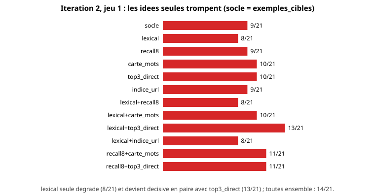
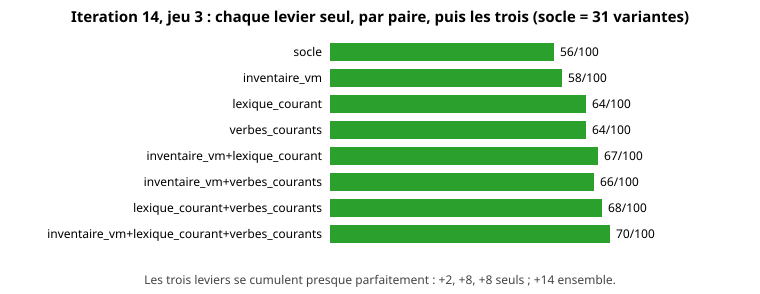
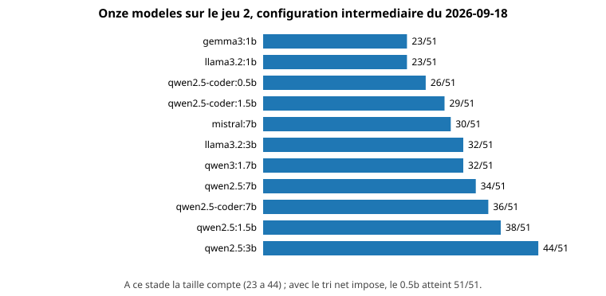

# Faire choisir le bon outil a un modele de 0,5 milliard de parametres : une boucle d'amelioration mesuree, mecanisme avant modele

*Amine Arouabah (amineutron), septembre 2026. Version de travail, non relue par des pairs. Code, jeux de test et resultats bruts : https://github.com/amineutron/lyra (AGPL-3.0). English version: [2026-09-boucle-ephaistos.en.md](2026-09-boucle-ephaistos.en.md).*

## Resume

Lyra est un assistant vocal local qui pilote des machines virtuelles, des sauvegardes et la domotique d'un logement a travers 88 outils MCP repartis sur cinq serveurs. Le composant qui choisit l'outil et ses arguments (EPHAISTOS) repose sur `qwen2.5-coder:0.5b`, un modele de 800 Mo qui repond en deux a cinq secondes sur un GPU grand public. Au depart, il ne trouvait le bon outil pour aucune des 21 requetes que les regles ecrites a la main ne couvraient pas. Nous decrivons une boucle d'amelioration en 21 iterations, conduite en quatre jours, dont le principe est de mesurer le mecanisme qui presente les candidats au modele avant de toucher au modele ou au prompt. Chaque idee est une variante activable, mesuree seule, par paire et combinee, a graine fixe, contre une hypothese ecrite avant la mesure. Le score sur le jeu initial passe de 0/21 a 21/21 ; sur cinq jeux de developpement successifs, la configuration finale atteint 100 %. La mesure qui compte est celle de trois jeux scelles avant toute iteration et mesures une seule fois : 41/50, 35/50 et 42/50, soit une generalisation comprise entre 70 et 85 % sur du langage libre jamais vu. Nous montrons que les leviers qui generalisent sont des donnees et des decisions mecaniques (paraphrases, tri lexical, outil impose quand le tri est net, inventaire reel), que toutes les consignes ajoutees au prompt ont degrade le modele, que la taille du modele n'a compte qu'une fois le mecanisme corrige, et que le banc doit mesurer le chemin de production, faute de quoi il mesure autre chose.

## 1. Contexte et probleme

Un assistant qui execute des commandes doit transformer une phrase libre (« mets staging-03 au repos ») en un appel d'outil precis (`vm_stop(vm_name="staging-03")`) parmi des dizaines de candidats. Lyra le fait en trois etapes : des regles Python deterministes pour les formulations frequentes ; a defaut, une recherche dans un index des outils (RAG a trois niveaux, ChromaDB, embeddings `paraphrase-multilingual-MiniLM`) qui remonte des specifications candidates ; puis un modele de langage qui choisit l'outil et remplit les arguments. Le choix d'un tres petit modele est une contrainte de conception : execution locale, latence de quelques secondes, 4 Go de VRAM pour l'ensemble du systeme.

Le probleme initial etait simple a enoncer et faux a diagnostiquer. Sur un banc de 21 requetes non couvertes par les regles, EPHAISTOS trouvait le bon outil 0 fois. Trois sessions de travail avaient conclu que le modele etait trop petit et avaient ajuste le prompt, sans effet durable. Un indice contredisait cette conclusion : un modele de 7 milliards de parametres ne faisait pas mieux qu'un modele de 1 milliard sur le meme banc. Si la taille ne change rien, le probleme n'est pas dans le modele.

## 2. Methode

### 2.1 Principe

La boucle applique cinq regles, dans cet ordre.

1. **Hypothese ecrite avant la mesure**, avec l'impact attendu en nombre de cas. Sans hypothese prealable, un chiffre qui bouge n'enseigne rien.
2. **Mesurer le mecanisme avant le modele.** Le rang du bon outil parmi les candidats presentes, et la precision du critere qui decide d'imposer un outil, se calculent sans appel au modele, en vingt secondes par configuration (`scripts/bench_recall.py`). Une idee sans effet mecanique n'est pas mesuree au banc.
3. **Une idee est une variante nommee**, activable par une variable d'environnement (`LYRA_EXP`), implementee par une fonction pure testee. Le banc (`scripts/bench_boucle.py`) mesure chaque variante seule, par paire, et toutes ensemble, au-dessus de l'acquis des iterations precedentes, a graine fixe (`LYRA_SEED=42`). Sans graine, le meme banc varie de plus ou moins un cas sur sept. La figure 1 montre pourquoi les paires sont indispensables : une variante peut degrader seule et etre decisive combinee.



*Figure 1. Iteration 2 sur le jeu 1 : les douze premieres configurations mesurees (socle, variantes seules, paires). La recherche lexicale seule fait perdre un cas ; associee a la fenetre de trois specs elle en gagne quatre.*
4. **Classer chaque echec restant** automatiquement : le bon outil etait-il montre au modele, a quel rang ; le modele a-t-il invente un nom, choisi un voisin, rate un argument. La reponse brute et le prompt exact sont conserves.
5. **Recommencer** tant que le seuil (99 %) n'est pas atteint, et consigner hypotheses et resultats de chaque iteration dans un journal public (issue de suivi).

### 2.2 Jeux de test

Six jeux ont ete ecrits au fil de la boucle. Le premier (21 requetes, proches des regles, TV, cast, lumieres) est le banc d'origine. Le second (51 formulations inedites sur les cinq serveurs) a ete ecrit pour mesurer la generalisation du premier ; un controle mecanique (`scripts/controle_hors_regles.py`) refuse toute phrase prise par une regle ou recopiee d'une paraphrase indexee. Les jeux suivants (100, 50, 50, 50 phrases, registre quotidien, vrais noms de machines) ont ete ecrits selon un protocole fixe apres le jeu 3 : **sceller le jeu suivant avant de toucher au code, le mesurer une fois, ne jamais iterer dessus**. Le jour ou un jeu scelle sert a une iteration, il perd son statut et un nouveau jeu est scelle.

Le score est le nombre de cas ou l'outil choisi est le bon (ou un equivalent declare, par exemple `cast_youtube` pour `youtube_video`) et ou les arguments obligatoires sont presents. Un score « strict », sans equivalences, est publie a cote.

### 2.3 Materiel

RTX 3080 Ti (12 Go), ollama, `qwen2.5-coder:0.5b` pour EPHAISTOS et `llama3.2:1b` pour le dialogue. Une mesure a la fois, machine au repos ; une campagne lancee sous charge a ete abandonnee deux fois par manque de memoire.

## 3. Resultats

### 3.1 Progression


*Figure 2. Meilleure configuration de chaque iteration, par jeu de developpement. Les nombres sont lus dans `benchmarks/results/` par `scripts/gen_figures_boucle.py`.*

| Jeu | Depart | Final | Iterations |
|---|---|---|---|
| 1 (21) | 0 (5 apres la reparation du banc) | 21 | 1 a 5, puis 11 a 13 |
| 2 (51) | 13 | 51 | 1 a 11 (numerotation propre au jeu) |
| 3 (100) | 56 (mesure unique) | 100 | 14 a 21 |
| 4 (50) | 41 (mesure unique) | 50 | 17 a 21 |
| 5 (50) | 35 (mesure unique) | 50 | 17 a 21 |
| 6 (50) | **42 (mesure unique)** | jamais itere | |

### 3.2 Ce qui a compte, dans l'ordre chronologique

**Le banc lui-meme etait en panne.** Le premier travail a ete de faire refuser la publication a un banc dont une API avait disparu : le 0/21 initial comptait des pannes techniques comme des echecs du modele. Le vrai point de depart etait 5/21.

**Le modele ne voyait pas la bonne reponse.** Mesure sans modele : le bon outil figurait parmi les cinq candidats remontes par l'index pour 8 requetes sur 21, en premiere position pour 4. Et le modele ne recevait qu'une seule specification au premier essai. Trois causes, toutes dans le mecanisme : un prompt systeme de 6 100 tokens dans une fenetre de 4 096 ; un index perime par rapport aux paraphrases ecrites depuis ; une expression reguliere d'extraction (`[^E]+?`) incapable de traverser un E majuscule, qui faisait perdre toutes leurs paraphrases a 38 outils sur 88.

**Les donnees d'abord.** Regenerer l'index avec des paraphrases pour tous les outils, sans doublon, a porte le bon outil de 8 a 20 fois sur 21 dans les candidats. Le score, lui, n'a pas bouge tout de suite : montrer la bonne reponse ne suffit pas a un modele de cette taille.

**Un exemple par specification, tire de ses paraphrases.** C'est le levier qui a transforme le recall en score (iteration 3, 15 puis 18/21). Un modele de 0,5 milliard imite un exemple ; il ne suit pas une regle.

**Toutes les consignes ont degrade le modele.** Une regle de routage par mot-cle, un rappel « eteindre = outil *_off », une consigne sur les URL, deux exemples au lieu d'un : chaque ajout au prompt a fait baisser le score. Le dernier cas du premier banc a ete gagne en **retirant** une phrase du prompt.

**Quand le tri est net, ne pas demander au modele.** Les candidats sont retries par des cartes de mots (« moins » designe `down`, « sans le son » designe `mute`, « le point » designe `status`). Quand le premier candidat a au moins deux points et un de plus que le suivant, l'outil est impose et le modele ne fait que les arguments. La precision de ce critere, mesuree sans modele, est de 27/27 au moment de son introduction et de 70/0 (nets corrects / nets faux) a la fin. C'est ce qui a mene le jeu 2 de 39 a 51/51, la ou un modele de 1,5 milliard ne faisait pas mieux que celui de 0,5.

**Les leviers qui generalisent ne dependent pas des phrases.** Apres la mesure unique du jeu 3 (56/100), trois leviers ecrits sans regarder ses echecs : l'inventaire reel des machines lu au demarrage (a la place d'un motif de nom), un lexique de langue courante ecrit domaine par domaine, les memes verbes dans les cartes de tri. La figure 3 donne leur ablation complete ; ils se cumulent presque additivement (56, 70, puis 82 a l'iteration suivante).



*Figure 3. Iteration 14 sur le jeu 3 : chaque levier seul, chaque paire, les trois ensemble, au-dessus du socle de 31 variantes.*

**Un defaut de code, pas de modele.** A l'iteration 18, cinq echecs avaient le bon outil en premiere position avec un tri net, et le modele repondait autre chose : l'outil impose par la premiere passe etait remis en jeu par une seconde passe. Le corriger a rapporte un point et 30 % d'appels au modele en moins (543 s a 381 s pour 100 requetes).

### 3.3 Ce que vaut un jeu scelle


*Figure 4. Pour chaque jeu scelle : mesure unique (gris) et score apres iteration (vert). Seul le gris mesure la generalisation.*

Le 21/21 du jeu 1 et le 51/51 du jeu 2 mesuraient la boucle, pas le produit : la configuration qui faisait 72/72 a donne 56/100 sur le jeu 3 ecrit apres coup. Trois jeux scelles de 50 phrases, mesures une fois chacun avec des configurations a un point d'ecart sur le jeu de developpement, ont donne 41, 35 et 42. Nous en tirons deux conclusions : la generalisation de ce mecanisme avec un modele de 0,5 milliard se situe entre 70 et 85 % sur du langage libre ; et un chiffre sur 50 phrases porte plusieurs points d'incertitude, ce qui interdit de comparer deux configurations sur un seul jeu de cette taille.

En usage reel, entre 16 et 24 phrases sur 50 de chaque jeu sont prises par une regle avant tout appel au modele.

### 3.4 Comparaison de modeles



*Figure 5. Onze modeles sur le jeu 2, configuration intermediaire du 2026-09-18 (17 a 22 variantes). Les trois modeles de 7 milliards sont battus par un 3 milliards de la meme famille.*

A ce stade la taille comptait, dans une fourchette de 23 a 44. Une fois le tri net et l'outil impose en place, le modele de 0,5 milliard a atteint 51/51 sur ce meme jeu, et le 1,5 milliard ne faisait pas mieux a configuration egale. Le mecanisme a rendu la taille du modele secondaire.

### 3.5 Le banc mesurait un chemin que le produit n'executait pas

Une recette manuelle, vingt phrases dites au systeme reel, a donne des reponses sans rapport avec le banc. Le banc appelait EPHAISTOS directement ; le pipeline de production lui envoyait une seule specification, sans son nom d'outil (le modele lisait alors le premier mot de la description comme nom), puis laissait un contexte de session et un classificateur d'intention ecraser le resultat. Une fois le pipeline aligne sur le banc, et le banc dote d'un mode qui traverse le pipeline reel (`--reel`), les trois jeux de developpement donnent 21/21, 43/43 et 91/92 sur le chemin de production, les refus corrects (machines inexistantes) comptes a part. Cette etape aurait du preceder toute publication de chiffre.

## 4. Ce qui n'a pas marche

Dix-sept variantes ont ete mesurees puis retirees du code, leurs mesures restant dans les resultats publies : les consignes de prompt (routage, on/off, URL, numerotation des specs), le vote sur trois ordres de candidats (un modele de cette taille n'est pas bruite, il est attire par le meme voisin a chaque appel), la resolution floue d'un nom invente, l'assouplissement du critere net (la mesure mecanique annoncait trois faux positifs, le banc a perdu quatre points), l'extension de la requete par synonymes avant le tri (le bruit gagnait), le format JSON contraint, la deduplication des specs, un second exemple par spec.

## 5. Limites

Un seul modele cible a ete itere ; les comparaisons de modeles sont a une configuration intermediaire. Les jeux sont ecrits par une seule personne, en francais, sur un seul logement : les ambiguites restantes (« allume l'entree » : ni lampe ni groupe de ce nom sur le pont) refletent cette installation. Les jeux scelles font 50 phrases, ce qui donne une fourchette et non un chiffre. Le seuil de 99 % a ete atteint sur les jeux de developpement, jamais sur un jeu scelle. Enfin, les cartes de mots et les lexiques sont ecrits a la main : ils generalisent mieux que les phrases, mais restent lies au domaine.

## 6. Conclusion

Le modele n'etait pas le probleme. Ce qu'on lui montrait l'etait : un index perime, une seule specification, aucun exemple, un tri qui ne decidait rien, et un pipeline de production different du banc. Chaque fois que nous avons voulu aider le modele par une consigne, il a fait moins bien. Chaque fois que nous avons corrige ce qu'il voyait, ou decide a sa place quand le mecanisme etait sur, il a fait mieux. La methode qui a permis de le voir tient en trois gestes : ecrire l'hypothese avant la mesure, mesurer le mecanisme sans le modele, sceller le jeu suivant avant de toucher au code. Le chiffre a publier n'est jamais celui du jeu sur lequel on a travaille.

## Reproduire

```
git clone https://github.com/amineutron/lyra
LYRA_SEED=42 .venv/bin/python scripts/bench_recall.py --jeu hors_regles_2 --configs "DEFAUT"
LYRA_SEED=42 .venv/bin/python tests/test_campaign_llm.py --ephaistos qwen2.5-coder:0.5b --jeu hors_regles_5 --reel
.venv/bin/python scripts/gen_figures_boucle.py
```

Methode detaillee : `docs/dev/BOUCLE_AMELIORATION.md`. Mesures datees : `BENCHMARKS.md` et `benchmarks/results/` (75 fichiers JSON). Journal des iterations : issue #72 du depot de suivi.
