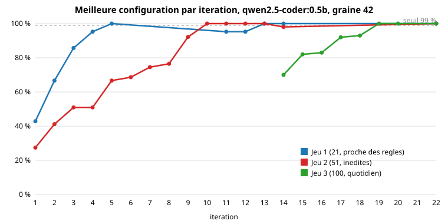
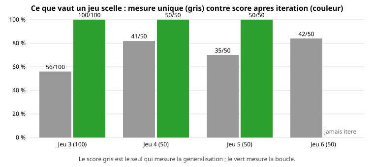

# Un modele de 0,5 milliard de parametres qui comprend quatre commandes libres sur cinq : ce que la boucle a appris

*Lyra, septembre 2026. Brouillon a relire.*

Lyra est un assistant vocal local qui pilote des machines virtuelles, des
sauvegardes et la domotique d'un appartement a travers 88 outils MCP repartis
sur cinq serveurs. Le composant qui choisit l'outil, EPHAISTOS, tourne sur
`qwen2.5-coder:0.5b` : 800 Mo de VRAM, deux a cinq secondes par requete. Le 17
septembre, il ne trouvait le bon outil pour **aucune** des 21 requetes que les
regles ecrites a la main ne couvraient pas. Trois jours plus tard, il en
trouve 21 sur 21, et surtout **42 sur 50** sur un jeu de phrases qu'il n'avait
jamais vues. Cet article raconte comment, avec les chiffres, et surtout ce
qui n'a pas marche.

## Le point de depart : accuser le modele

Trois sessions avaient conclu que le 0.5b etait trop petit. Le 7b ne faisait
pas mieux que le 1b sur le meme banc, ce qui aurait du alerter : si la taille
ne change rien, le probleme n'est pas dans le modele.

La premiere mesure utile n'a pas appele le modele. Elle a compte, pour
chacune des 21 requetes, a quel rang le RAG remontait le bon outil dans les
cinq specs qu'il transmet. Reponse : le bon outil etait dans la liste **8
fois sur 21**, en premiere position 4 fois. Et EPHAISTOS ne recevait qu'**une
seule** spec au premier essai. Le modele ne pouvait pas choisir ce qu'on ne
lui montrait pas.

Trois causes, toutes cote Lyra : le prompt systeme debordait la fenetre de
contexte de 4 096 tokens servie par ollama ; l'index etait perime par rapport
aux paraphrases ecrites depuis ; et une regex d'extraction (`[^E]+?`)
s'arretait sur toute majuscule E, si bien que 38 outils sur 88 avaient perdu
toutes leurs paraphrases. Un bug de regex avait fait passer trois sessions a
regler des prompts.

## La methode

Une seule idee, appliquee vingt-et-une fois :

1. **Hypothese ecrite avant la mesure**, avec l'impact attendu en nombre de
   cas. Sans ca, on ne sait pas ce qu'on a appris quand le chiffre bouge.
2. **Mesurer le mecanisme avant le modele.** Le rang du bon outil apres tri,
   et la precision du critere qui impose un outil, se calculent sans appel au
   modele en vingt secondes. Une idee sans effet mecanique ne merite pas un
   banc de dix minutes.
3. **Chaque idee est une variante** activable par une variable d'environnement,
   avec une fonction pure et un test. Le banc la mesure **seule, par paire,
   et combinee** au-dessus de l'acquis, a graine fixe. Les idees seules
   trompent : la recherche lexicale seule degradait le score et etait decisive
   en paire ; « tout ensemble » a fait pire que la meilleure seule a la
   premiere iteration.
4. **Classer chaque echec restant** automatiquement : le bon outil etait-il
   montre ? A quel rang ? Le modele a-t-il invente un nom, choisi un voisin,
   rate un argument ? La reponse brute et le prompt exact sont conserves.
5. Recommencer tant que le seuil n'est pas atteint.

Tout est dans le depot : `scripts/bench_boucle.py`, `scripts/bench_recall.py`,
`scripts/controle_hors_regles.py`, les resultats JSON dates dans
`benchmarks/results/`, et le journal de chaque iteration dans une issue.

## Ce qui a compte, dans l'ordre

**Les donnees d'abord.** Regenerer l'index avec des paraphrases pour tous les
outils, sans doublon, a fait passer le bon outil de 8 a 20 fois sur 21 dans
les cinq specs. Le score, lui, n'a pas bouge tout de suite : montrer la bonne
reponse ne suffit pas a un 0.5b, il faut aussi lui montrer un exemple.

**Un exemple par spec, tire de ses paraphrases.** C'est le levier qui a
transforme le recall en score. A l'inverse, toutes les consignes ajoutees au
prompt (« si la requete contient une URL... », « eteindre = outil off ») ont
degrade le 0.5b. Le dernier cas du premier banc a ete gagne en **retirant**
une phrase.

**Quand le tri est net, ne pas demander au modele.** Les specs sont retriees
par des cartes de mots (« moins » vers `down`, « sans le son » vers `mute`,
« le point » vers `status`). Quand le premier a deux points d'avance, l'outil
est impose et le modele ne fait que les arguments. Mesure sans modele : ce
critere avait raison 27 fois sur 27, puis 70 fois sur 70. C'est ce qui a mene
le jeu 2 de 39 a 51 sur 51, la ou le 1.5b ne faisait pas mieux que le 0.5b.

**Les leviers qui ne dependent pas des phrases.** Lire l'inventaire reel des
machines au demarrage au lieu d'un motif de nom ; un lexique de langue
courante ecrit domaine par domaine et non a partir des echecs d'un banc ; les
memes verbes dans les cartes de tri. Sur le troisieme jeu : 56, puis 70, puis
82 sur 100.

**Un bug de code, pas de modele.** A la dix-huitieme iteration, cinq echecs
avaient le bon outil en premiere position avec un tri net, et le modele
repondait autre chose. L'outil impose par la premiere passe etait remis en
jeu par la seconde. Le corriger a rapporte un point et 30 % d'appels au modele
en moins. Lire le prompt exact ne suffit pas : il faut lire le code qui suit
la reponse.

## Ce qui n'a pas marche

- Les consignes dans le prompt, toutes. Un 0.5b lit un exemple, pas une regle.
- Le vote sur trois ordres de specs : le 0.5b n'est pas bruite, il est attire
  par le meme voisin a chaque fois. Le reinterroger ne sert a rien.
- Assouplir le critere « net » : la mesure mecanique annoncait trois faux
  positifs de plus, le banc a perdu quatre points. Le mecanisme avait raison.
- Etendre la requete de synonymes avant le tri : le bruit gagnait.
- Dix-sept variantes au total, mesurees puis retirees du code.

## Ce que vaut vraiment le score

Le 21 sur 21 du premier banc, puis le 51 sur 51 du second, mesuraient la
boucle, pas le produit. Le troisieme jeu, ecrit apres coup et mesure une seule
fois, a donne **56 sur 100** a la configuration qui faisait 72 sur 72. La
regle depuis : **sceller le jeu suivant avant de toucher au code**, le mesurer
une fois, ne jamais iterer dessus. Trois jeux scelles de 50 phrases ont donne
41, 35 et 42 : la generalisation d'un 0.5b avec ce mecanisme est dans une
fourchette de **70 a 85 %** sur du langage libre, et un chiffre sur 50 phrases
porte plusieurs points d'incertitude. Les cinq jeux qui ont servi a la boucle
sont a 100 %, et ce chiffre-la ne dit rien.

En usage reel, entre 16 et 24 phrases sur 50 de chaque jeu sont prises par une
regle avant tout appel au modele. Les echecs restants sont des ambiguites que
seul l'inventaire reel peut lever (« allume l'entree » : ni lampe ni groupe de
ce nom sur le pont Hue) ou des tournures rares.

## Ce qu'on retient

Le modele n'etait pas le probleme. Ce qu'on lui montrait l'etait : un index
perime, une seule spec, aucun exemple, et un tri qui ne decidait rien. Chaque
fois qu'on a voulu « aider » le modele par une consigne, il a fait moins bien.
Chaque fois qu'on a corrige ce qu'il voyait, ou decide a sa place quand le
mecanisme etait sur, il a fait mieux. Et le chiffre a publier n'est jamais
celui du jeu sur lequel on a travaille.

Depot : https://github.com/amineutron/lyra (AGPL-3.0). Methode detaillee :
`docs/dev/BOUCLE_AMELIORATION.md`. Mesures : `BENCHMARKS.md`.
