# Installeur Lyra

Point d'entree unique : `./installer/install.sh` (depuis un clone du repo).
Deux frontaux consomment exactement le meme pipeline :

- `--tui` (defaut) : installeur terminal Rich (boot ASCII, menu MCPs a
  cocher aux fleches, mascotte, pipeline anime). Apres le boot, un ecran
  propose de rester en terminal ou de basculer vers l'app graphique
  (le processus devient alors le serveur de l'app).
- `--app` : lance directement l'installeur graphique local (design
  neutroncore) sur `http://127.0.0.1:9877/ui/` — backend Python stdlib,
  frontend React pre-builde et commite dans `app/backend/static/`.
- `--headless` : sans interface, chaque question recoit sa valeur par defaut
  (journalisee), sortie texte ; MCP par `--mcps id1,id2`. Pour les tests en VM
  (`tests/installer/vm_install_test.sh`) et les machines sans terminal.

`--demo` simule tout le parcours sans executer une seule commande.

## Pipeline

Ordre reel des etapes (`installer/core/pipeline.py:build_pipeline`), verifie
en conditions reelles sur Fedora/Ubuntu/Arch. `post` (reindexation RAG)
tourne **avant** `daemon` : le demon charge lui aussi ChromaDB au demarrage,
et les deux en concurrence sur un repertoire tout neuf provoquaient une
course (schema sqlite cree deux fois) -- observee et corrigee.

```mermaid
flowchart LR
    SYS["system<br/>paquets distro"] --> CLONE["clone<br/>repo Lyra (SSH -> PAT si besoin)"]
    CLONE --> VENV["venv<br/>python -m venv"]
    VENV --> PIP["pip<br/>chromadb, torch cpu,<br/>sentence-transformers..."]
    PIP --> PIPER["piper<br/>lien /usr/local/bin/piper"]
    PIPER --> VOICE["voice<br/>voix fr_FR-upmc-medium"]
    VOICE --> OLLAMA["ollama<br/>client (meme en mode distant)"]
    OLLAMA --> MODELS["models<br/>pull qwen2.5-coder:0.5b<br/>+ llama3.2:1b"]
    MODELS --> MCPS["MCP selectionnes<br/>(0 a N, clone + install)"]
    MCPS --> CONFIG["config<br/>config.yaml / secrets.yaml"]
    CONFIG --> POST["post<br/>reindexation RAG (ChromaDB)"]
    POST --> DAEMON["daemon<br/>lyra-daemon (systemd user)"]
```



Les repos MCP prives (`fedora-agents`, `hue-mcp`, `pylips-mcp`...) partagent
le meme fallback d'authentification que le clone du repo principal
(`core/gitauth.py resolve_repo_url`) : SSH testee en premier (et le succes
alimente `known_hosts`), sinon un Personal Access Token est demande **une
seule fois par run** et reutilise pour tous les MCPs prives suivants --
jamais ecrit sur disque.

## Architecture

```
installer/
├── install.sh          # bootstrap (venv ephemere rich/pyyaml/requests) + dispatch
├── assets/mascots.json # mascottes ASCII partagees TUI/app (source: neutroncore)
├── core/               # logique pure, testee (tests/installer/)
│   ├── catalog.yaml    # catalogue declaratif des MCPs  <-- AJOUTER UN MCP ICI
│   ├── catalog.py      # chargement + validation stricte
│   ├── osdetect.py     # /etc/os-release -> famille + paquets (fedora/debian/arch)
│   ├── state.py        # InstallState immuable
│   ├── events.py       # Output/Progress/StepChange/Ask/Result + AskBroker
│   ├── runner.py       # Popen streamable, jamais shell=True
│   ├── pipeline.py     # StepDef declaratifs + run_pipeline
│   ├── configpatch.py  # config.yaml/secrets.yaml en YAML in-process
│   └── steps/          # system, clone, venv, piper, ollama, mcps,
│                       # config, systemd (demon!), post
├── tui/                # frontal terminal
└── app/                # frontal web (backend/ stdlib 9877 + frontend/ Vite)
```

## Ajouter un MCP au catalogue

Une entree YAML dans `core/catalog.yaml` suffit : id, repo (prive
amineutron/...), dest, runtime (python|node), fields (les champs `secret:
true` vont dans secrets.yaml chmod 600, jamais dans config.yaml),
config/server (blocs injectes dans config.yaml), check (http|tcp),
extra_steps (npm_build, sudoers, hue_pairing, pip_catt). `sudoers` copie
`<dest>/scripts` en root:root dans /usr/local/lib/lyra/scripts puis ecrit
/etc/sudoers.d/lyra (une regle par script, visudo -cf, jamais de glob). Les deux
frontaux et les tests le prennent en compte automatiquement.

## Garanties

- Les secrets (credentials TV, pairing Hue username+clientkey) ne
  touchent jamais config.yaml (`assert_no_secrets`, teste).
- config.yaml/secrets.yaml existants : backup horodate avant ecriture.
- Le demon systemd `lyra-daemon` est installe et active (PATH avec
  `.venv/bin` en tete — piege documente dans CLAUDE.md).
- Repos prives : pre-vol SSH GitHub, fallback https+PAT saisi a la volee
  (jamais ecrit sur disque).

## Derrière un proxy d'entreprise

L'installeur et Lyra ne lisent aucune variable qui leur soit propre pour le
réseau : ils respectent celles que les outils sous-jacents lisent déjà.

| Variable | Lue par | Effet |
|---|---|---|
| `HTTP_PROXY`, `HTTPS_PROXY`, `NO_PROXY` | curl, pip/uv, requests, le script d'installation d'Ollama | tout le trafic sortant passe par le proxy |
| `PIP_INDEX_URL` (ou `UV_INDEX_URL`) | pip / uv | miroir PyPI interne pour le venv |
| `HF_ENDPOINT` | huggingface_hub (modèles Whisper, MiniLM) et le téléchargement des voix Piper | miroir Hugging Face interne |
| `OLLAMA_HOST` | le client `ollama` et Lyra (`get_ollama_base_url`, prime sur `llm.base_url` de config.yaml) | Ollama distant, machine sans GPU, Codespace |

Trois endroits ne voyaient pas ces variables ; ils sont traités
(`installer/core/proxyenv.py`, `lyra/utils/netenv.py`) :

- **sudo** remet l'environnement à zéro : `sudo dnf install` / `sudo apt-get
  install` partaient sans proxy. Toute commande `sudo` de l'installeur reçoit
  `--preserve-env=<variables définies>`. Si ta politique sudoers l'interdit
  (utilisateur sans droit `SETENV`), ajoute
  `Defaults env_keep += "HTTP_PROXY HTTPS_PROXY NO_PROXY http_proxy https_proxy no_proxy"`
  via `visudo`.
- **le service `ollama`** (systemd) n'hérite pas du shell, or c'est lui qui
  télécharge lors d'un `ollama pull`. Avec un proxy défini, l'installeur écrit
  `/etc/systemd/system/ollama.service.d/proxy.conf` (`Environment=HTTPS_PROXY...`),
  recharge systemd et redémarre le service s'il tournait.
- **Lyra elle-même** : avec `HTTP_PROXY` seul, httpx et requests enverraient aussi
  au proxy les appels à l'Ollama local, à l'API tracking (127.0.0.1:8765) et
  aux serveurs MCP locaux. Le client et le démon ajoutent `localhost,127.0.0.1,::1`
  à `NO_PROXY` au démarrage (seulement si un proxy est défini) ; les MCP lancés
  par le démon en héritent.

Les mots de passe éventuels dans l'URL du proxy sont masqués dans les messages
de l'installeur.

Exemple :

```bash
export HTTPS_PROXY=http://proxy.interne:3128 NO_PROXY=localhost,127.0.0.1,.interne
export PIP_INDEX_URL=https://nexus.interne/repository/pypi/simple
export HF_ENDPOINT=https://hf-mirror.interne
export OLLAMA_HOST=gpu-box.interne:11434
python3 installer/install.py
```

## Machine sans Internet : bundle hors ligne

Limite actuelle : le bundle est une commande séparée, pas encore proposée par
l'installeur, et il n'a pas été rejoué de bout en bout sur une VM sans réseau
(suivi : issue [#25](https://github.com/amineutron/lyra/issues/25)).

`installer/bundle.py` met dans une seule archive (environ 3 Go) tout ce que
l'installeur télécharge : modèles Ollama, MiniLM (RAG) et Whisper (micro),
binaire et voix Piper, wheels Python du venv. Chaque fichier est contrôlé par
sha256 avant toute copie : une archive altérée ou tronquée est refusée en entier.

```bash
# machine connectée, depuis le dépôt (le venv fournit huggingface_hub)
.venv/bin/python -m installer.bundle create --out lyra-bundle.tar
#   --parts ollama,hf,piper,wheels   --whisper base|small|...|aucun

# machine sans réseau (python3 du système suffit)
python3 -m installer.bundle install lyra-bundle.tar --lyra-dir ~/lyra
LYRA_OFFLINE=1   # ensuite : interdit tout téléchargement de modèle
```

- Les modèles Ollama sont téléchargés par un serveur Ollama privé et temporaire
  (`OLLAMA_MODELS` pointé vers le bundle) : ni sudo ni lecture du dossier du
  service. À l'installation, la copie vers `/usr/share/ollama/.ollama/models`
  passe par sudo si ce dossier n'est pas inscriptible.
- Les wheels sont celles de la plateforme de la machine qui crée le bundle
  (même architecture et même version de Python attendues).
- Hors bundle : les paquets système (portaudio, git, nodejs...) et le binaire
  Ollama, à installer depuis le média de la distribution ; les serveurs MCP.
- Au démarrage, Lyra charge les modèles Hugging Face depuis le cache local sans
  interroger huggingface.co (`lyra/utils/hf_local.py`) ; le réseau ne sert que
  si le modèle manque, et jamais avec `LYRA_OFFLINE=1` ou `HF_HUB_OFFLINE=1`.

## Rebuild du frontend app

```
make installer-ui       # npm install + build -> app/backend/static/ (commite)
```

## Tests

```
.venv/bin/python -m pytest tests/installer/ -q
./installer/install.sh --tui --demo
./installer/install.sh --app --demo
```
